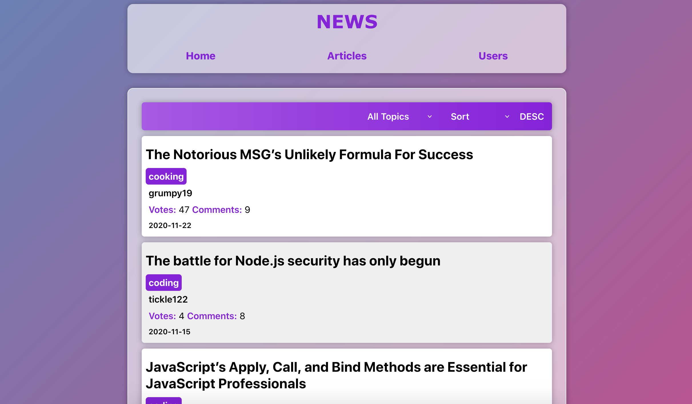
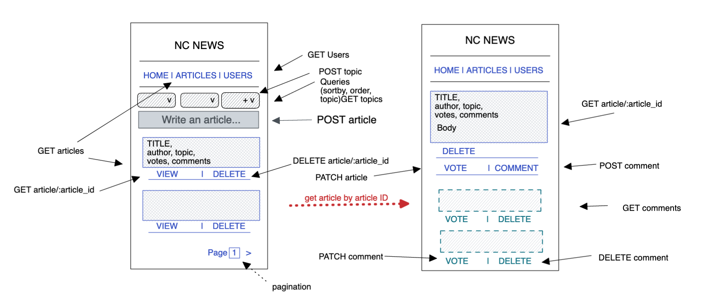

# News app
The front-end portion of a News app, created with React. 
Browse through articles, sort and filter the list, view, vote and comment on any article!

**LIVE SITE:** https://sarahadev-news.netlify.app

News app is split into 2 separate deployables, a web client and a backend server. 
Check out the backend here: https://github.com/SarahADev/News-API



## Run locally

1. Install Node/npm. Make sure you have Node.js v18.4.0 or newer installed.
2. Clone and install dependencies. Run the following commands:
```
git clone https://github.com/SarahADev/FE-news_ST.git
cd nc-news
npm install
```
3. Start the app:
```
npm start
```
## Basic Usage:

Use the navigation bar to render different 'pages' of the site. Articles can be sorted, ascending or descending, by properties and filtered by topic. The URL will update with any topic selected. 
View any single article, vote on, comment on or delete posts made by you.

## How It's Made:


**Tech used:** React, CSS

An initial wireframe and component tree was planned. This was so I could keep track of both integration of api functionality into the client, and the structure of this repo.
A 'work in progress' component tree was also continually updated so I could see how current work was structured and to compare with the plan.



React Hooks:
useContext was used for the logged in user. useState and useEffect were used to store and render information retrieved from the server with axios.

Routes for navigation:
Whilst this app is a single-page application, routes are valuable to allow users to 
individually address (share) certain parts of the site. Routes also allow browser history navigation.


## Optimisations

Optimistic rendering and conditional rendering is used in this project for users to receive (render) immediate UI feedback when making calls to the api. For instance, when making a GET request, a loading message will conditionally render until those articles are fetched. When a user votes on an article, the vote count will increment before an api call is made, but decrement if that call fails.

This project was designed mobile-first to account for a responsive display.
With more time, I would like to add a light and dark mode to the app.

## Lessons Learned:

Plan for the minimal viable product first, and later the 'nice to haves'. My initial wireframe was too complex in order to account for the maximum server functionality.